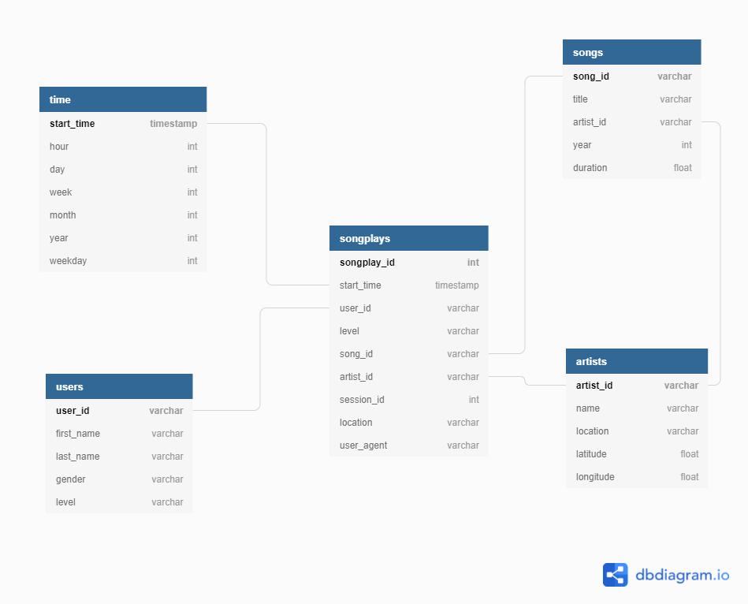
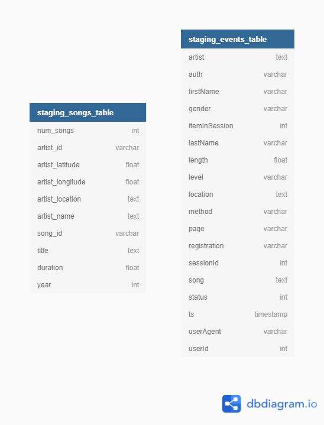
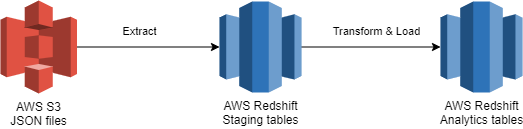

# Data Engineering Nanodegree Program

## Data Warehouse

### 1. Project scope

A startup called Sparkify have a music streaming app and they want to 
move their process and data onto a cloud data warehouse. In this
project, the Data Engineer is supposed to extract data from AWS S3,
stage and transform into dimensional tables using AWS Redshift.

### 2. Data Source

Before digging into the database design and the ETL pipeline, we need 
to understand how the data is structured and stored. In this project, 
the data is structured in JSON and stored in a AWS S3. There are two
directories: `data/song_data`, which contains the artists' and song's 
metadata partitioned by the first three letters of each song's track 
ID and the `data/log_data`, which contains activity logs from the 
music streaming app partitioned by month and year.

*Song data filepath examples:*

```
song_data/A/B/C/TRABCEI128F424C983.json
song_data/A/A/B/TRAABJL12903CDCF1A.json
```

*Song data file example:*

```
{
    "num_songs": 1,
    "artist_id": "ARULZCI1241B9C8611",
    "artist_latitude": null,
    "artist_longitude": null,
    "artist_location": "",
    "artist_name": "Luna Orbit Project",
    "song_id": "SOSWKAV12AB018FC91",
    "title": "Midnight Star",
    "duration": 335.51628,
    "year": 0
}
```

*Log data filepath example:*

```
log_data/2018/11/2018-11-12-events.json
log_data/2018/11/2018-11-13-events.json
```


*Single log example from a log data file:*

```
{
    "artist": null,
    "auth": "Logged Out",
    "firstName": null,
    "gender": null,
    "itemInSession": 0,
    "lastName": null,
    "length": null,
    "level": "free",
    "location": null,
    "method": "PUT",
    "page": "Login",
    "registration": null,
    "sessionId": 52,
    "song": null,
    "status": 307,
    "ts": 1541207073796,
    "userAgent": null,
    "userId": ""
}
```

### 3. Data Warehouse Setup

Since we already understand the problem, it's time to work on the solution.
The first step was choosing a relational database schema that would fit 
the needs of the company. Since we needed a model optimized to specific
and simple queries, the chosen schema was the star schema with the songplays
log data as a fact table and the users, songs, artists and time data as
dimension tables. Then, we need to setup the Redshift cluster, creating an
IAM Role to access and modify the cluster, creating the cluster and opening 
an incoming TCP Port to access the cluster endpoint. Finally we create the
tables that follows the below diagrams:

 

### 4. ETL Pipeline

In order to achieve the relational structure from the JSON data, I had to
build an ETL pipeline. The general idea of the `etl.py` was to extract the 
S3 data to two staging tables in Redshift using the `COPY` statement,
transform with `SELECT` statement and load with `INSERT INTO`
statement.



The *staging_events_table* and the *staging_songs_table* are exact copies
of the *log_data* and *song_data* S3 directories respectively. To the songs 
and artists tables, I used the *song_data* directory files and for the time,
users and songplays tables, I used the *log_data* directory. It is important 
to note that the insert statement for the users' table has a `WHERE` clause
with a subquery to insert the last user data available in the log, to support
level changes. Also, the insert statements for the songs, artists and time
tables have a `SELECT DISTINCT` clause to avoid duplicated values.

### 5. Project Files

Some files were already mentioned in the previous sections,but I will list
here again to those who want a quick summary.


- `create_tables.py`: python script that creates the *sparkfydb* database and it's tables;
- `etl.py`: python script that run through all the data files, load's them into a dataframe
and insert into the respective tables;
- `sql_queries.py`: python script that contains all the SQL statements used in the aforementioned files;
- `images`: folder containing the images used to write this README file.


To run the project, one should first run the `create_tables.py` script with
the terminal command `python create_tables.py`  and then run the `etl.py`
script with the terminal command `python etl.py`.